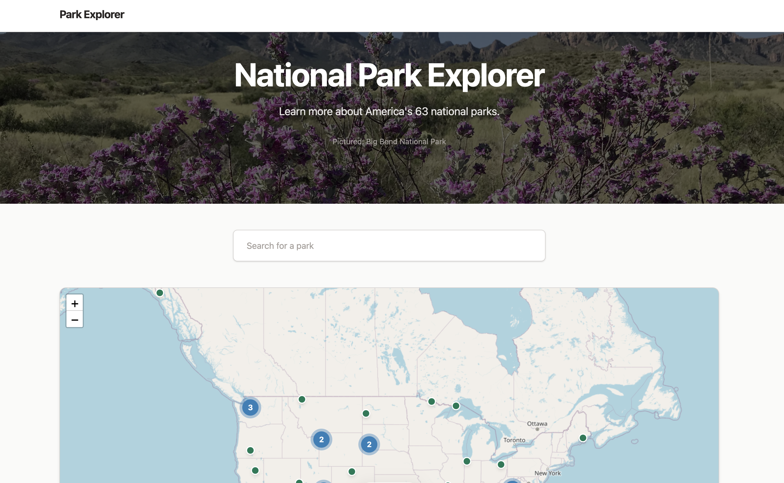
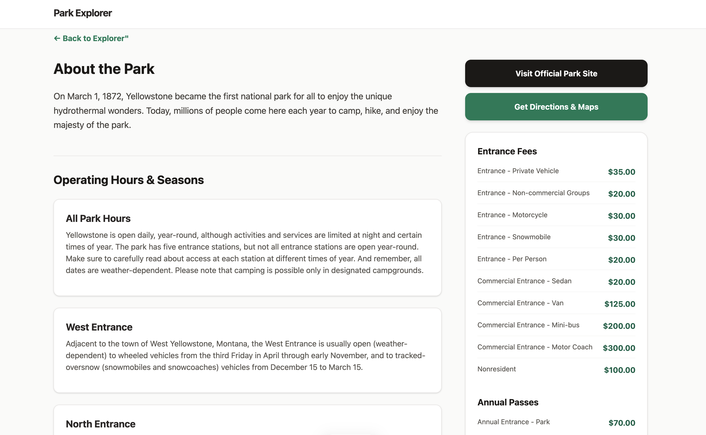

# National Park Explorer

## Description
A web application designed to help users learn more about the 63 official US National Parks. The National Park Service API was used to retrieve detailed park data. Also features an interactive map for exploration & dynamic park detail pages.

## Technologies Used

* React.js
* Leaflet.js 
* National Park Service (NPS) API
* TailwindCSS

## Installation and Setup

### Prerequisites
* Node.js and React.js installed
* An active API key from the National Park Service (NPS API) https://www.nps.gov/subjects/developer/get-started.htm

* Clone the repository: `git clone https://github.com/nwins372/National-Park-Explorer.git`
* CD to the project directory `cd National-Park-Explorer` in, open up a terminal and run the command `npm install`
* Create a .env file in the root directory and add your NPS API key `REACT_APP_NPS_API_KEY=api_key_here`
* Finally, run the command `npm run dev`

### TODO:
- Implement local storage or a backend database to allow users to save visited parks
- Allow user to filter parks by state or available activities
- Add user authentication and a review system for individual parks.
- Expand search functionality to query national monuments, historic sites, and trails beyond the core 63 parks.
